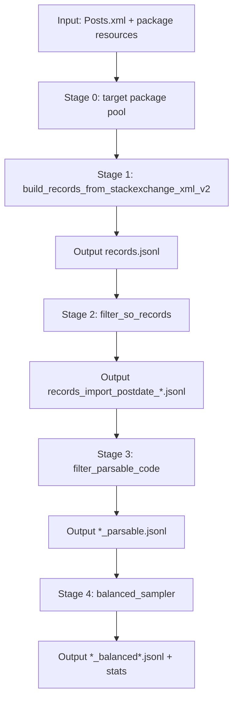

# dataset_builder: StackExchange dataset construction

This document explains how to build a dataset from StackExchange `Posts.xml` under `dataset_builder/`, including per-stage filtering logic and tunable options.

## 1. Entry script and role

`build_stackoverflow_dataset.py`: **end-to-end** build (base extraction + post filters + parsability filter + balanced sampling).

**Usage (repository root; optional: `source .venv/bin/activate`):**

```bash
python -m dataset_builder.build_stackoverflow_dataset --help
```

## 2. End-to-end flow



## 3. Stage-by-stage logic

### Stage 0: target package set

Code:

- `package_pool.py::load_target_packages`, `build_package_pool`

Two input modes:

1. Explicit `--target-packages-path`
   - JSON list (e.g. `["django", "numpy"]`)
   - JSON dict containing `vulnerable_top_intersection`
   - Alias-mapping style dict (keys are canonical package names)
2. Automatic build (no `--target-packages-path`)
   - Read top packages from `top_pypi` (`--top-limit` caps how many)
   - Read vulnerable package set from the OSV index
   - Intersect to get candidate targets
   - Optionally expand via `mapping.json` (import name → PyPI name) into `mapped_intersection`

Controls:

- `--top-limit`: consider only the first *N* popular packages (smaller = stricter; larger = higher recall, more noise).
- `mapping.json` expansion: when a vulnerable name is an import name, map it to the real PyPI name to reduce misses.

### Stage 0.5: alias mapping (optional)

Code:

- `alias_mapping_converter.py::build_alias_mapping_for_targets`
- `stackexchange_builder.py::load_alias_mapping`

Logic:

- Turn `mapping.json` `import -> package` into `package -> [aliases]`.
- Keep only canonical packages present in `target_packages`.
- Skip entries where `import_name == canonical_name` (avoid trivial self-aliases).

Controls:

- `--alias-mapping-path`: manually supply a mapping file.
- `--disable-auto-alias-from-mapping`: disable auto-generated alias mapping.

### Stage 1: extract records from Posts.xml (two-pass)

Code:

- `stackexchange_builder.py::build_records_from_stackexchange_xml_v2`

#### Pass 1 (index questions)

Keep when:

- `PostTypeId == 1` (question)
- `AcceptedAnswerId` is present
- `Score >= --min-score`
- Ignore synthetic IDs (`question_id >= 1_000_000_000`)

Persist into SQLite `questions`:

- Question text, tags, python context (`python` / `python-*` tags)
- Target hits from tags (`question_tag_hits`)

#### Pass 2 (answers → JSONL)

Process only:

- `PostTypeId == 2` (answer)
- Answer is the `accepted_answer_id` of an indexed question

Additional filters:

1. **Code block gate**: answer must contain `<pre><code>...</code></pre>`.
2. **Python context gate** (either):
   - Question tags imply Python; or
   - Answer code AST-parses to `import` / `from` root modules.
3. **Target hit** (controlled by `match_mode`):
   - `conservative`: hits only from answer imports.
   - `balanced`: tag hit OR import hit.
   - `recall`: `balanced` OR textual Python cues (`import` / `from` / `pip install` / `conda install`).
   - Legacy aliases: `strict -> balanced`, `relaxed -> recall`.
4. Drop if no hit (`skip_no_target_hit`).

Concurrency / caps:

- `--pass2-workers`: thread count for Pass 2 (>= 1).
- `--max-questions`: stop after writing this many records.

Outputs:

- `records.jsonl`
- `stackexchange_work/stackexchange_summary.json`

### Stage 2: post-filter (import evidence + post date)

Code:

- `filter_so_records.py::filter_records`

**Usage:**

```bash
python -m dataset_builder.filter_so_records --help
```

Step 1: import-evidence filter

- By default require at least one of in `metadata.match_source`:
  - non-empty `answer_code_imports`, or
  - non-empty `import_gate`
- Disable with `--no-require-import-evidence`

Step 2: filter by answer creation time (`CreationDate >= --cutoff-date`)

- `date-filter-mode=exact`:
  - Use `answer_time_index.sqlite3` to resolve real timestamps for candidate `answer_id`.
- `date-filter-mode=id_threshold` (fast approximation):
  - Find smallest `answer_id` meeting the cutoff; keep candidates with `answer_id >= cutoff_answer_id`.
  - Relies on approximate monotonicity of StackOverflow IDs vs time (faster, possible edge error).

Outputs:

- `records_import_candidates.jsonl`
- `records_import_postdate_ge*.jsonl`
- `records_import_postdate_ge*.stats.json`

### Stage 3: parsable-code filter

Code:

- `filter_parsable_code.py::filter_parsable_records`

**Usage:**

```bash
python -m dataset_builder.filter_parsable_code --help
```

Processing:

- Normalize each code block (strip REPL prompts, dedent, trim).
- Ignore blocks shorter than `--min-code-chars`.
- Classify with `ast.parse` + `codeop.compile_command`: `ast_ok / incomplete / syntax_error / empty`.

Keep/drop QA pairs per `--pair-pass-mode`:

- `any_block`: keep if any block is `ast_ok`.
- `merged`: keep only if concatenated valid blocks are `ast_ok` overall.
- `any_or_merged`: keep if either rule holds (default, higher recall).

Output records gain `parsed_code` with selected code and parse status.

### Stage 4: balanced sampling

Code:

- `balanced_sampler.py::sample_balanced_records` (imported by the E2E driver; no standalone CLI)

Goal:

- Fairer allocation across `target_packages` at a fixed total size.

Mechanism:

1. With `k` packages, quotas: `target_total // k`, remainder `rem` packages get +1.
2. Phase 1: fill each package toward its quota.
3. Phase 2: if under total, keep assigning to the most under-filled package (min `assigned/quota` first).
4. Persist stats (mean, std, top-10 packages, etc.).

Controls:

- `--balanced-total`: target number of records.
- `--balanced-seed`: RNG seed for reproducibility.

## 4. Common commands

### 4.1 Full end-to-end build

```bash
python -m dataset_builder.build_stackoverflow_dataset \
  --run-name so_e2e \
  --posts-xml-path /path/to/Posts.xml \
  --top-limit 15000 \
  --match-mode balanced \
  --cutoff-date 2016-01-01T00:00:00 \
  --date-filter-mode exact \
  --pair-pass-mode any_or_merged \
  --balanced-total 5000 \
  --balanced-seed 42
```

## 5. Artifact quick reference

Run directory: `outputs/dataset_builder/<run-name>/`

- `records.jsonl`: stage-1 raw candidates
- `records_import_postdate_*.jsonl`: after stage 2
- `*_parsable.jsonl`: after stage 3
- `*_balanced*.jsonl`: final balanced sample
- `summary.json` / `e2e_summary.json`: run-level summaries

## 6. Parameter guidance (precision vs recall)

- **Stricter (precision)**: `match_mode=conservative` + `date-filter-mode=exact` + `pair-pass-mode=merged`.
- **Balanced default**: `match_mode=balanced` + `pair-pass-mode=any_or_merged`.
- **Higher recall**: `match_mode=recall` (adds more text-cue-based hits).
- **Scale**: prioritize `top-limit`, `cutoff-date`, and `balanced-total`.
